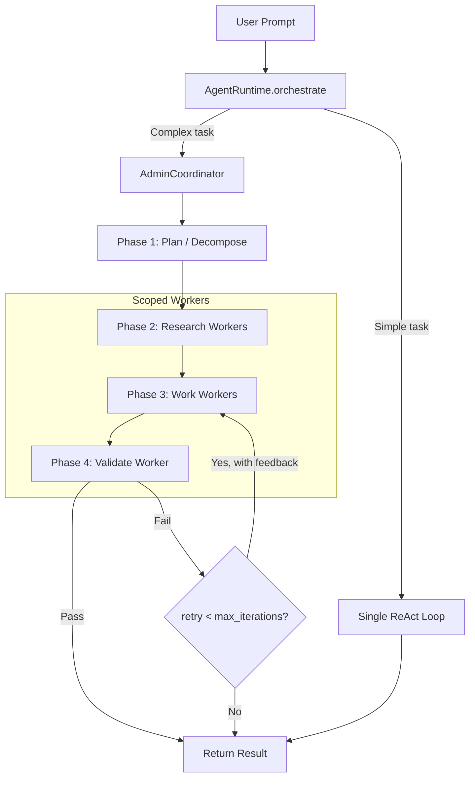
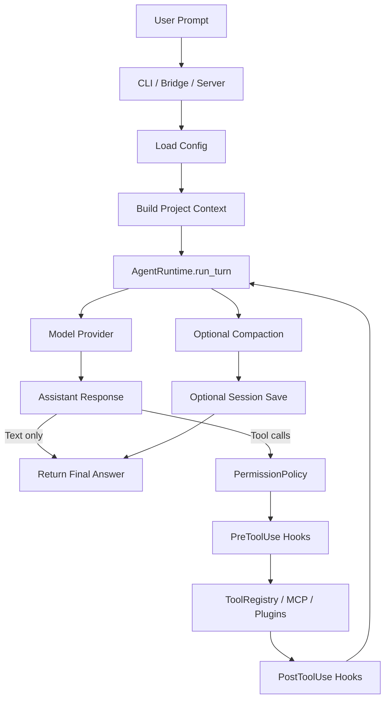

# YuCode

Python-first coding agent runtime and VS Code bridge with multi-worker orchestration -- a clean-room port of the Rust-based `claw-code-main` project, with zero npm dependencies.

This repository is not open source. No license is granted for use, redistribution, or derivative works unless explicitly agreed by the copyright holder.

## Requirements

- Python >= 3.10
- `rg` (ripgrep) on PATH for `grep_search` tool

## Install

```bash
# Core (no external dependencies beyond the standard library)
pip install -e .

# With the HTTP/SSE session server
pip install -e ".[server]"

# With all optional MCP micro-server extras
pip install -e ".[all]"

# Non-editable install (from wheel or sdist)
pip install .
```

After installation the `yucode` command is available system-wide.

## Quick Start

```bash
# 1. Scaffold a new project directory
yucode init /path/to/my-project

# 2. Or create/edit your user config and test provider access
yucode init-config

# 3. Interactive chat (REPL with tab-completion)
yucode chat --workspace .

# 4. One-shot prompt
yucode chat "Explain this codebase" --workspace .

# 5. Start the HTTP + SSE session server (requires the server extra)
yucode serve --workspace .
```

You can also invoke the CLI without installing:

```bash
python -m coding_agent.interface.cli chat --workspace .
```

### Install to a new directory

```bash
# Scaffold config and instruction files
yucode init /path/to/new-project

# This creates:
#   /path/to/new-project/.yucode/settings.yml    (safe shared defaults)
#   /path/to/new-project/.yucode/settings.local.yml (local secrets overlay)
#   /path/to/new-project/.env.example            (env var template)
#   /path/to/new-project/.yucode/mcp.yml         (MCP servers)
#   /path/to/new-project/.yucode/skills/          (skill directory)
#   /path/to/new-project/YUCODE.md                (project instructions)
```

## Architecture

### Multi-Worker Coordinator

YuCode supports three orchestration modes, controlled by `runtime.orchestration_mode`:

| Mode | Behavior |
|------|----------|
| `single` | Classic single-agent ReAct loop (one LLM, all tools) |
| `multi` | Always use the AdminCoordinator with phased workers |
| `auto` | Coordinator decides based on task complexity heuristics |



**Key concepts:**

- **Workers** are scoped `AgentRuntime` instances with role-appropriate tool subsets
- **Research workers** get read-only tools (read, grep, web search)
- **Work workers** get write tools (edit, write, bash, notebook)
- **Validate workers** get read + bash to check results
- **`max_iterations`** controls retry depth (validate-fail-redo cycles)
- **`max_worker_steps`** controls how many LLM rounds each individual worker gets
- The `agent` tool supports a `role` parameter for explicit role-based scoping

### Runtime config

```yaml
runtime:
  max_iterations: 32        # max validate->retry cycles
  max_worker_steps: 20      # max LLM rounds per worker
  orchestration_mode: auto  # auto | single | multi
  parallel_workers: false   # reserved for future parallel execution
```

## Project Layout

Layered architecture following the L0-L4 agent design pattern:

```
coding_agent/
  __init__.py              Public API exports

  interface/               L0 - Interface Layer
    cli.py                 CLI entrypoint (yucode command)
    render.py              Claude Code-like terminal UI (spinner, cards, banner)
    bridge.py              VS Code JSONL bridge
    server.py              HTTP + SSE session server
    commands.py            Slash commands and @file refs

  core/                    L1 - Runtime Core
    runtime.py             Agent loop (AgentRuntime) + orchestrate()
    coordinator.py         AdminCoordinator, WorkerRole, ROLE_TOOLS
    session.py             Messages, usage tracking, persistence
    providers.py           OpenAI-compatible model provider

  tools/                   L2 - Tool Layer
    __init__.py            Tool registry, specs, risk levels
    filesystem.py          File read/write/edit/glob/grep
    shell.py               Bash tool with safety checks
    web.py                 Web fetch and search (multi-step research)
    office.py              Word/Excel/PowerPoint/PDF read+write
    notebook.py            Jupyter notebook editing
    agent_tool.py          Sub-agent tool with role support
    misc.py                Todo, MCP, skills, config, sleep

  memory/                  L3 - Memory & Context
    compact.py             Session compaction / token estimation
    prompting.py           System prompt assembly
    skills.py              Skill file discovery

  security/                Cross-cutting security
    permissions.py         5-level permission model
    sandbox.py             Container detection and isolation
    safety.py              Bash command safety checks

  config/                  Cross-cutting configuration
    settings.py            Multi-level YAML/JSON config
    simple_yaml.py         Minimal YAML parser (no PyYAML)
    config.yml             Default config template

  hooks/                   Cross-cutting hooks
    __init__.py            Pre/post tool-use hook system

  plugins/                 Extensions
    __init__.py            Plugin discovery and management
    mcp.py                 MCP stdio client
    mcp_servers/           Built-in MCP micro-servers

  observability/           Metrics and audit
    metrics.py             Tool usage, session stats, security events

pyproject.toml             Packaging and optional extras
```

## Single-Agent Flow

When `orchestration_mode` is `single` or the task is simple:



## Troubleshooting

### Empty response with 0 tokens

If `yucode chat` prints a blank answer with all-zero token usage:

1. **Run diagnostics** — `yucode doctor --workspace .` checks config, API key, and provider connectivity.
2. **Check your API key** — set the `YUCODE_API_KEY` environment variable or add `api_key` to `~/.yucode/settings.yml` (or `.yucode/settings.local.yml` in the project).
3. **Check `provider.base_url` and `provider.model`** — the URL must be the base endpoint (e.g. `https://api.deepseek.com`) and the model name must be valid for that provider.
4. **Try disabling streaming** — some providers do not support SSE streaming. Set `provider.stream: false` in your config and retry.
5. **Use a clean virtualenv** — installing yucode into a global Python environment can cause unrelated `pip` dependency conflicts (e.g. `camelot-py`, `tableauhyperapi`). These warnings are cosmetic and do not affect yucode, but a clean virtualenv avoids confusion:

```bash
python -m venv .venv
# Windows: .venv\Scripts\activate
# macOS/Linux: source .venv/bin/activate
pip install yucode-agent
```

### Provider compatibility

YuCode uses the OpenAI-compatible `/chat/completions` API. It recognises both OpenAI-style and Anthropic-style response shapes:

| Key style | `content` | `usage` |
|-----------|-----------|---------|
| OpenAI | `string` | `prompt_tokens` / `completion_tokens` |
| Anthropic / block | `[{"type":"text","text":"..."}]` | `input_tokens` / `output_tokens` |

If your provider returns a different payload format, open an issue.

## Documentation

See [coding_agent/README.md](coding_agent/README.md) for the full manual -- run modes, config reference, command catalog, tool list, MCP/plugin guide, and optional dependency matrix.
