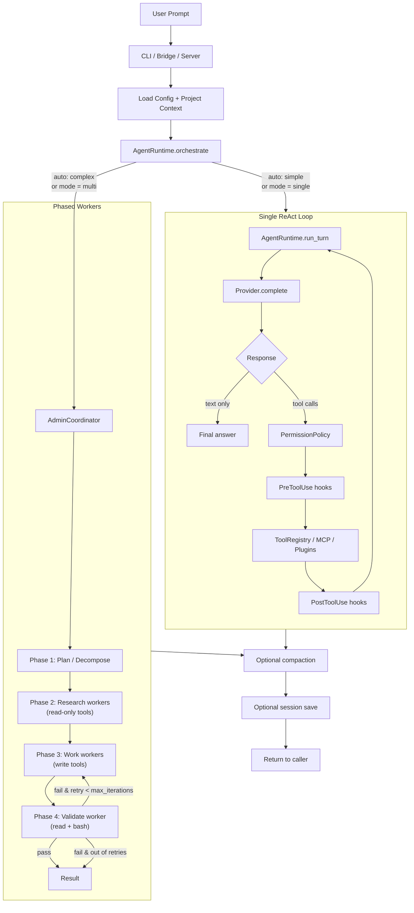

# YuCode

Python-first coding agent runtime and VS Code bridge with multi-worker orchestration -- a clean-room port of the Rust-based `claw-code-main` project, with zero npm dependencies.

This repository is not open source. No license is granted for use, redistribution, or derivative works unless explicitly agreed by the copyright holder.

## Install

```bash
pip install -e ".[all]"   # editable, all optional extras
pip install .             # standard install
```

After installation the `yucode` command is available system-wide.

## Methodology

YuCode is built around the idea that a coding agent should not be a single monolithic ReAct loop. Real engineering tasks alternate between *understanding*, *changing*, and *verifying*, and each of those phases benefits from a different tool surface, a different prompt frame, and a different stopping rule. YuCode formalises that intuition into an **adaptive orchestration runtime** that can collapse to a single agent for trivial tasks and expand into a phased worker pool for complex ones -- without the caller having to choose.

### Adaptive orchestration

The runtime exposes three modes via `runtime.orchestration_mode`: `single` always runs the classic ReAct loop, `multi` always uses the `AdminCoordinator`, and `auto` (the default) lets the coordinator decide based on task complexity heuristics. In `auto` mode the agent reads the prompt, classifies it against a shape/cost model, and either dispatches it directly or decomposes it into research, work, and validate phases. Crucially, the *same* `AgentRuntime` powers both paths -- the multi-worker mode simply spawns scoped child runtimes whose tool whitelists are filtered by `WorkerRole`.

### Phased workers and scoped tools

When the coordinator picks the multi-worker path, it runs four phases: **Plan** decomposes the task; **Research** workers (read-only tools: read, grep, web search) gather context; **Work** workers (write tools: edit, write, bash, notebook) make changes; and **Validate** workers (read + bash) check the result. If validation fails, the coordinator loops back into Work with the validator's feedback as additional context, up to `max_iterations` times. Each individual worker is bounded by `max_worker_steps` LLM rounds so a stuck sub-task cannot consume the whole budget. Tool scoping is not advisory -- it is enforced at the `ToolRegistry` layer of the child runtime, so a research worker cannot write files even if the model tries.

### Unified runtime flow



Each scoped worker is itself a full `AgentRuntime` running the inner `Single ReAct Loop`, so the multi-worker phases inherit the same permission, hook, and tool-execution pipeline. There is no separate code path for "agent vs sub-agent" -- only the tool whitelist and role prompt change.

### Provider-agnostic by design

YuCode speaks the OpenAI-compatible `/chat/completions` API and accepts both OpenAI-style (`prompt_tokens` / `completion_tokens`, string content) and Anthropic-style (`input_tokens` / `output_tokens`, content blocks) response shapes. The default `streaming_mode: hybrid` tries SSE streaming first and automatically falls back to non-streaming if the provider returns an empty stream -- a common failure mode for enterprise gateways that proxy `/chat/completions` but mishandle SSE. Errors raised by the provider layer are typed (`ProviderError`, `RetriesExhaustedError`, `ContextWindowExceededError`) so callers can decide whether to retry, compact, or abort.

### State, safety, and observability

Operational state (sessions, audit logs, metrics, todos, exports, plugins, archives, checkpoints) lives under `~/.yucode/projects/<workspace_key>/` rather than polluting the working directory; config lives in `~/.yucode/settings.yml`. Every tool call passes through a 5-level permission policy and pre/post hook system, and high-risk tools (`bash`, `web_fetch`, `agent`) carry explicit safety limits -- bash command pattern checks, fetch size and redirect caps, sub-agent timeouts. Tool usage, session stats, and security events are recorded by the observability layer for post-hoc inspection.

## Usage

```bash
yucode init /path/to/project          # scaffold per-project state and instructions
yucode init-config                    # create user-level config and probe the provider
yucode chat --workspace .             # interactive REPL
yucode chat "Explain this codebase" --workspace .   # one-shot
yucode serve --workspace .            # HTTP + SSE session server (needs server extra)

python -m coding_agent.interface.cli chat --workspace .   # without installing
```

## Troubleshooting (brief)

If `yucode chat` returns a blank answer with zero tokens, run `yucode doctor --workspace .` first -- it probes the provider in both streaming and non-streaming modes and reports the exact endpoint URL, payload keys, and any envelope error messages. The most common causes are a wrong `base_url` / `chat_path` / `append_chat_path` combination pointing at a gateway instead of `/chat/completions`, an invalid `model` name, or a provider that needs `verify_tls: false` behind an enterprise proxy. Setting `provider.streaming_mode: no_stream` is a useful escape hatch for providers that mishandle SSE.

## Documentation

See [coding_agent/README.md](coding_agent/README.md) for the full manual -- run modes, config reference, command catalog, tool list, MCP/plugin guide, and optional dependency matrix.
