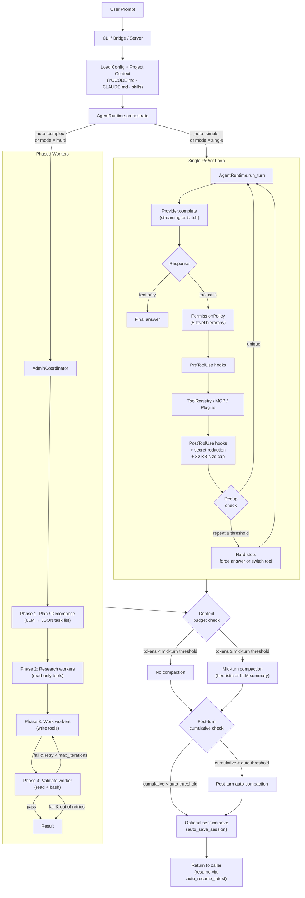

# YuCode

Python-first coding agent runtime and VS Code bridge with multi-worker orchestration -- a clean-room port of the Rust-based `claw-code-main` project, with zero npm dependencies.

This repository is not open source. No license is granted for use, redistribution, or derivative works unless explicitly agreed by the copyright holder.

## Install

```bash
pip install -e ".[all]"   # editable, all optional extras
pip install .             # standard install
```

After installation the `yucode` command is available system-wide.

## Methodology

YuCode is built around the idea that a coding agent should not be a single monolithic ReAct loop. Real engineering tasks alternate between *understanding*, *changing*, and *verifying*, and each of those phases benefits from a different tool surface, a different prompt frame, and a different stopping rule. YuCode formalises that intuition into an **adaptive orchestration runtime** that can collapse to a single agent for trivial tasks and expand into a phased worker pool for complex ones -- without the caller having to choose.

### Adaptive orchestration

The runtime exposes three modes via `runtime.orchestration_mode`: `single` always runs the classic ReAct loop, `multi` always uses the `AdminCoordinator`, and `auto` (the default) lets the coordinator decide based on task complexity heuristics. In `auto` mode the agent reads the prompt, classifies it against a shape/cost model, and either dispatches it directly or decomposes it into research, work, and validate phases. Crucially, the *same* `AgentRuntime` powers both paths -- the multi-worker mode simply spawns scoped child runtimes whose tool whitelists are filtered by `WorkerRole`.

### Phased workers and scoped tools

When the coordinator picks the multi-worker path, it runs four phases: **Plan** decomposes the task; **Research** workers (read-only tools: read, grep, web search) gather context; **Work** workers (write tools: edit, write, bash, notebook) make changes; and **Validate** workers (read + bash) check the result. If validation fails, the coordinator loops back into Work with the validator's feedback as additional context, up to `max_iterations` times. Each individual worker is bounded by `max_worker_steps` LLM rounds so a stuck sub-task cannot consume the whole budget. Tool scoping is not advisory -- it is enforced at the `ToolRegistry` layer of the child runtime, so a research worker cannot write files even if the model tries.

### Unified runtime flow



Each scoped worker is itself a full `AgentRuntime` running the inner `Single ReAct Loop`, so the multi-worker phases inherit the same permission, hook, and tool-execution pipeline. There is no separate code path for "agent vs sub-agent" -- only the tool whitelist and role prompt change.

### Project context and memory

Before every turn the runtime assembles a system prompt from several sources, merged in priority order:

| Source | Purpose |
|---|---|
| `YUCODE.md` / `CLAUDE.md` / `CLAW.md` | Per-project conventions, schemas, and workflow instructions |
| `YUCODE.local.md` / `CLAUDE.local.md` | Local overrides not committed to git |
| `.yucode/instructions.md` / `.claw/instructions.md` | Subdirectory-level rules |
| `.claude/commands/*.md` / `.yucode/skills/<name>/SKILL.md` | Named skills / slash commands loadable via `load_skill` |

All candidate paths are discovered by walking from the filesystem root down to the current working directory, so rules cascade naturally from global → project → subdirectory. The assembled prompt also includes current git status, estimated token usage, and a resume signal if prior messages are in context.

### Tool safety and search

The agent is given explicit search discipline in the system prompt: **workspace first, web second**. For any topic or file lookup it is instructed to use `grep_search` (content keywords) and `glob_search` (name patterns), and to read any existing index file (`wiki/index.md`, `README.md`, etc.) before falling back to `web_search`. When writing new files it checks loaded instruction files for required frontmatter, section structure, and link conventions.

Additional runtime-enforced safety:
- **32 KB tool result cap** -- prevents a single large file or search result from filling the context window; agent is directed to use `offset`/`limit` for targeted reads
- **Dedup hard stop** -- identical tool call repeated ≥ `dedup_tool_threshold` times in one turn is blocked with an explicit "switch tools or answer" instruction
- **Tool budget** -- a per-turn `max_tool_calls` ceiling prevents runaway loops
- **Permission hierarchy** -- five levels (`read-only`, `workspace-write`, `danger-full-access`, `prompt`, `allow`) enforced at `PermissionPolicy`; bash commands are additionally scanned for mutation patterns (`;`, `&&`, `sudo`, redirect operators)

### Context compaction (multi-layer)

Long sessions are managed by two independent compaction layers so the context window never fills silently:

| Layer | Trigger | Mechanism |
|---|---|---|
| Mid-turn | Start of each ReAct iteration when estimated tokens ≥ `compact_token_threshold` (default 60 000) | Drops oldest messages, preserves `compact_preserve_recent` (default 4) most recent; replaced by a summary injected as a system message |
| Post-turn auto | After each turn when cumulative provider input tokens ≥ `YUCODE_AUTO_COMPACT_INPUT_TOKENS` (default 100 000) | Same drop-and-summarise, fires once per turn boundary |

Both layers support two strategies: `heuristic` (structured timeline built from message metadata) and `llm` (a live provider call that writes a prose summary of what was dropped). Set `runtime.compact_strategy: llm` to enable the richer summaries.

Compaction is always preceded by archiving the current message list to `~/.yucode/projects/<key>/archives/` so nothing is permanently lost.

### Session continuity

Sessions are persisted and resumed automatically:
- `runtime.auto_save_session: true` (default) -- saves the full message history as `latest.json` after every turn
- `runtime.auto_resume_latest: true` (default) -- loads `latest.json` at startup; the system prompt tells the agent it is in a resumed session and how many prior messages exist
- Named saves: `/save <id>` and `yucode chat --resume <id>` for branching or long-term threads
- On resume the startup banner shows session age and the first user message so you can tell at a glance which context you are continuing

### Provider-agnostic by design

YuCode speaks the OpenAI-compatible `/chat/completions` API and accepts both OpenAI-style (`prompt_tokens` / `completion_tokens`, string content) and Anthropic-style (`input_tokens` / `output_tokens`, content blocks) response shapes. The default `streaming_mode: hybrid` tries SSE streaming first and automatically falls back to non-streaming if the provider returns an empty stream -- a common failure mode for enterprise gateways that proxy `/chat/completions` but mishandle SSE. Errors raised by the provider layer are typed (`ProviderError`, `RetriesExhaustedError`, `ContextWindowExceededError`) so callers can decide whether to retry, compact, or abort.

### State, safety, and observability

Operational state (sessions, audit logs, metrics, todos, exports, plugins, archives, checkpoints) lives under `~/.yucode/projects/<workspace_key>/` rather than polluting the working directory; config lives in `~/.yucode/settings.yml`. Every tool call passes through a 5-level permission policy and pre/post hook system, and high-risk tools (`bash`, `web_fetch`, `agent`) carry explicit safety limits -- bash command pattern checks, fetch size and redirect caps, sub-agent timeouts. Tool usage, session stats, and security events are recorded by the observability layer for post-hoc inspection.

## Usage

```bash
yucode init /path/to/project          # scaffold per-project state and instructions
yucode init-config                    # create user-level config and probe the provider
yucode chat --workspace .             # interactive REPL
yucode chat "Explain this codebase" --workspace .   # one-shot
yucode serve --workspace .            # HTTP + SSE session server (needs server extra)

python -m coding_agent.interface.cli chat --workspace .   # without installing
```

## Troubleshooting (brief)

If `yucode chat` returns a blank answer with zero tokens, run `yucode doctor --workspace .` first -- it probes the provider in both streaming and non-streaming modes and reports the exact endpoint URL, payload keys, and any envelope error messages. The most common causes are a wrong `base_url` / `chat_path` / `append_chat_path` combination pointing at a gateway instead of `/chat/completions`, an invalid `model` name, or a provider that needs `verify_tls: false` behind an enterprise proxy. Setting `provider.streaming_mode: no_stream` is a useful escape hatch for providers that mishandle SSE.

## Documentation

See [coding_agent/README.md](coding_agent/README.md) for the full manual -- run modes, config reference, command catalog, tool list, MCP/plugin guide, and optional dependency matrix.
