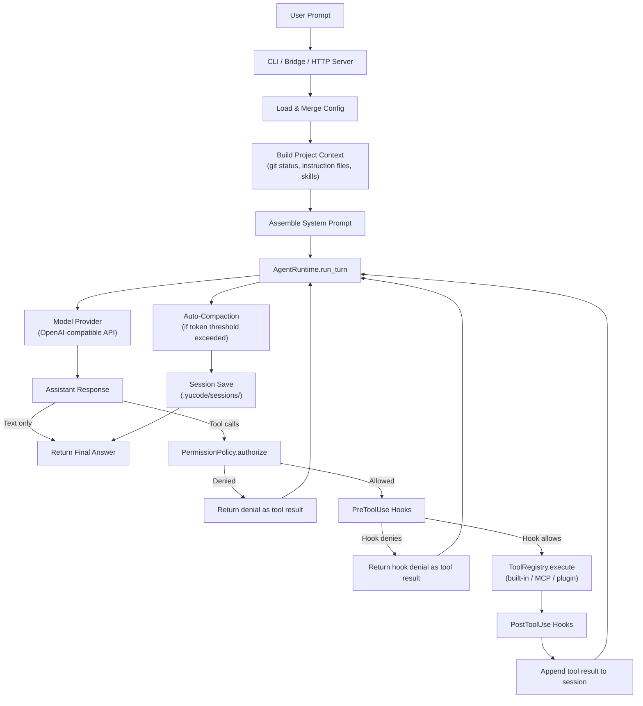

# coding_agent -- Full Manual

This document covers every way to run, configure, and extend the YuCode coding agent.

## Table of Contents

- [Architecture Overview](#architecture-overview)
- [Methodology Chart](#methodology-chart)
- [Run Modes](#run-modes)
  - [Interactive Chat (REPL)](#interactive-chat-repl)
  - [One-Shot Prompt](#one-shot-prompt)
  - [JSON Output](#json-output)
  - [Session Resume](#session-resume)
  - [VS Code Bridge](#vs-code-bridge)
  - [HTTP + SSE Server](#http--sse-server)
- [Configuration](#configuration)
  - [Default Config](#default-config)
  - [Multi-Level Config Discovery](#multi-level-config-discovery)
  - [Provider Setup](#provider-setup)
  - [Permission Modes](#permission-modes)
- [CLI Command Reference](#cli-command-reference)
- [Interactive Slash Commands](#interactive-slash-commands)
- [Built-in Tools](#built-in-tools)
- [MCP (Model Context Protocol)](#mcp-model-context-protocol)
  - [Managing MCP Servers](#managing-mcp-servers)
  - [Built-in MCP Presets](#built-in-mcp-presets)
- [Plugins](#plugins)
- [Skills](#skills)
- [Hooks](#hooks)
- [Session Compaction](#session-compaction)
- [Sandbox and Isolation](#sandbox-and-isolation)
- [Optional Dependencies](#optional-dependencies)
- [Python API](#python-api)

---

## Architecture Overview

```
coding_agent/
  __init__.py                Public API exports, version
  config/
    settings.py              Multi-level YAML/JSON config with deep merge, env-var secrets
    config.yml               Default config template
    simple_yaml.py           Minimal YAML parser (no external dependency)
  core/
    runtime.py               Core agent loop (AgentRuntime.run_turn), checkpoint/resume
    session.py               Messages, usage tracking, JSON persistence
    providers.py             OpenAI-compatible model provider (streaming + sync)
    coordinator.py           Multi-worker orchestration (AdminCoordinator)
    errors.py                Structured error hierarchy (AgentError, ProviderError, …)
  interface/
    cli.py                   CLI entrypoint ("yucode" command)
    server.py                HTTP + SSE session server (aiohttp)
    bridge.py                VS Code JSONL bridge
    commands.py              Slash commands and @file reference parsing
    render.py                Terminal UI rendering
  tools/
    __init__.py              ToolRegistry, ToolSpec, RiskLevel, MCP/plugin wiring
    filesystem.py            File read/write/edit/glob/grep tools
    shell.py                 Bash tool with sandbox integration
    web.py                   Web fetch and search tools
    notebook.py              Jupyter notebook editing
    office.py                Excel, Word, PowerPoint, PDF tools
    agent_tool.py            Sub-agent / role-scoped agent tool
    misc.py                  Todo, sleep, skill, config, search helpers
  memory/
    compact.py               Session compaction and token estimation
    prompting.py             System prompt assembly with project context
    skills.py                SKILL.md discovery across workspace and home
  security/
    permissions.py           5-level permission model with interactive prompter
    safety.py                Bash safety checks + secret scanning / redaction
    sandbox.py               Container detection and filesystem isolation
  hooks/
    __init__.py              Pre/post tool-use + pre/post compact hook system
  plugins/
    __init__.py              Plugin discovery, installation, and management
    mcp.py                   MCP stdio client (Content-Length JSON-RPC)
    mcp_servers/             Built-in MCP micro-servers (excel, word, pdf, finance)
  observability/
    metrics.py               Tool/session metrics + audit log persistence
    logging.py               Structured logging (text/JSON)
```

---

## Methodology Chart

The diagram below shows the complete request lifecycle from user prompt to final answer.



---

## Run Modes

### Interactive Chat (REPL)

Start an interactive session with tab-completion for slash commands and `@path` file references:

```bash
yucode chat --workspace .
```

Or without installing the package:

```bash
python -m coding_agent.cli chat --workspace .
```

The REPL shows the active provider/model, accepts natural language and slash commands, and maintains conversation history for the duration of the session.

### One-Shot Prompt

Run a single prompt and exit:

```bash
yucode chat "Explain the main function in cli.py" --workspace .
```

Override the model for a single invocation:

```bash
yucode chat "Review this file" --workspace . --model gpt-4o
```

Restrict which tools the agent can use:

```bash
yucode chat "Analyze this code" --workspace . --allowed-tools read_file grep_search glob_search
```

Set a specific permission level:

```bash
yucode chat "Fix the bug" --workspace . --permission-mode workspace-write
```

### JSON Output

Get structured JSON output instead of plain text:

```bash
yucode chat "List all TODO items" --workspace . --output-format json
```

Or with the shorter flag:

```bash
yucode chat "List all TODO items" --workspace . --json
```

The output includes `final_text`, `iterations`, and `events` (tool calls, results, provider info).

### Session Resume

Resume a previously saved session:

```bash
# List saved sessions first (from interactive mode use /resume)
yucode chat "Continue where we left off" --workspace . --resume <session_id>
```

Sessions are stored as JSON in `.yucode/sessions/`.

### VS Code Bridge

Start the JSONL stdin/stdout bridge for editor integration:

```bash
yucode bridge
```

The bridge accepts `handshake`, `load_config`, and `chat` messages as JSON lines on stdin and emits responses on stdout.

### HTTP + SSE Server

Start a REST API with Server-Sent Events for session management:

```bash
yucode serve --workspace . --host 127.0.0.1 --port 8080
```

Requires the `server` extra (`pip install yucode-agent[server]`).

Endpoints:

| Method | Path                       | Description               |
|--------|----------------------------|---------------------------|
| POST   | `/sessions`                | Create a new session      |
| GET    | `/sessions`                | List all sessions         |
| GET    | `/sessions/{id}`           | Get session details       |
| POST   | `/sessions/{id}/message`   | Send a user message       |
| GET    | `/sessions/{id}/events`    | SSE event stream          |

---

## Configuration

### Default Config

Generate the default config file:

```bash
yucode init-config
```

View the active config:

```bash
yucode show-config
```

Print the config file path:

```bash
yucode config-path
```

The default config is created at `coding_agent/config.yml` beside the package source. It contains provider profiles (openai, local, deepseek), runtime options, tool filters, and MCP server entries.

### Multi-Level Config Discovery

When no explicit `--config` path is given, the agent discovers and deep-merges config from these locations (later entries override earlier ones):

1. `~/.yucode/settings.yml` or `~/.yucode/settings.json` (user-level)
2. `.yucode/settings.yml` or `.yucode/settings.json` (project-level)
3. `.yucode/settings.local.yml` or `.yucode/settings.local.json` (local overrides, gitignored)
4. `.yucode/mcp.yml` (workspace MCP server definitions, merged into `mcp.servers`)

Both YAML and JSON formats are supported at every level.

### Provider Setup

The agent uses an OpenAI-compatible chat completions API. Configure a provider profile in your config:

```yaml
active_provider: openai

openai:
  api_key: "sk-..."
  api_base: "https://api.openai.com/v1"
  chat_model: "gpt-4o"
  enabled: true
```

Three built-in profiles exist: `openai`, `local` (localhost:1234), and `deepseek`. If only one profile has an `api_key`, it is auto-selected. Override the model at runtime with `--model`.

### Permission Modes

Five ordered levels control which tools the agent may use:

| Mode                  | Level | Behavior                                            |
|-----------------------|-------|-----------------------------------------------------|
| `read-only`           | 0     | Only read operations (file read, search, web fetch) |
| `workspace-write`     | 1     | Read + write within the workspace                   |
| `danger-full-access`  | 2     | Full shell access, no restrictions                  |
| `prompt`              | 3     | Ask the user before executing restricted tools      |
| `allow`               | 4     | Allow everything unconditionally                    |

Set in config (`runtime.permission_mode`) or override with `--permission-mode`.

---

## CLI Command Reference

All commands are available as `yucode <command>` (after `pip install -e .`) or `python -m coding_agent.cli <command>`.

| Command         | Description                                      |
|-----------------|--------------------------------------------------|
| `init-config`   | Create the default config file if missing        |
| `show-config`   | Print the active config                          |
| `config-path`   | Print the active config file path                |
| `chat [prompt]` | Run a prompt (or start interactive mode)         |
| `bridge`        | Start the VS Code JSONL bridge                   |
| `serve`         | Start the HTTP + SSE session server              |
| `mcp-list`      | List configured MCP servers                      |
| `mcp-add`       | Add an MCP server to `.yucode/mcp.yml`           |
| `mcp-remove`    | Remove an MCP server                             |
| `mcp-validate`  | Test connectivity to configured MCP servers      |
| `mcp-preset`    | Add a pre-built MCP server from the catalog      |
| `skills`        | List discovered skill files                      |
| `status`        | Show runtime status summary                      |

### `chat` Flags

| Flag               | Description                                             |
|--------------------|---------------------------------------------------------|
| `--workspace DIR`  | Set the workspace root (default: `.`)                   |
| `--model MODEL`    | Override the chat model                                 |
| `--permission-mode`| Override permission level                               |
| `--allowed-tools`  | Restrict tools to a whitelist                           |
| `--resume ID`      | Resume a saved session by ID                            |
| `--output-format`  | `text` (default) or `json`                              |
| `--json`           | Shorthand for `--output-format json`                    |

### `serve` Flags

| Flag             | Description                              |
|------------------|------------------------------------------|
| `--workspace DIR`| Set the workspace root (default: `.`)    |
| `--host HOST`    | Bind address (default: `127.0.0.1`)      |
| `--port PORT`    | Listen port (default: `8080`)            |

---

## Interactive Slash Commands

These are available inside the interactive REPL (`yucode chat`):

| Command          | Description                                      |
|------------------|--------------------------------------------------|
| `/help`          | Show help message                                |
| `/status`        | Show provider, workspace, tokens, message count  |
| `/config`        | Print current config                             |
| `/tools`         | List available tools                             |
| `/mcp`           | List configured MCP servers                      |
| `/skills`        | List discovered skills                           |
| `/plugins`       | List installed plugins                           |
| `/compact`       | Compact conversation to free context window      |
| `/diff`          | Show `git diff` output                           |
| `/branch`        | Show `git branch -v` output                      |
| `/commit MSG`    | Run `git add -A && git commit -m MSG`            |
| `/memory`        | Show project instruction files                   |
| `/permissions`   | Show current permission mode                     |
| `/resume [ID]`   | List saved sessions, or resume one by ID         |
| `/save [ID]`     | Save current session to `.yucode/sessions/`      |
| `/clear`         | Clear conversation history and usage counters    |
| `/agents`        | Info about the sub-agent tool                    |
| `/exit` or `/quit`| Exit interactive mode (also Ctrl-D)             |

Use `@path/to/file` in your prompt to include file contents as context. Tab-completion works for both slash commands and `@path` references.

---

## Built-in Tools

18 tools are registered by default. Each tool has a required permission level.

| Tool                | Permission          | Description                                    |
|---------------------|---------------------|------------------------------------------------|
| `read_file`         | read-only           | Read a text file (with optional offset/limit)  |
| `write_file`        | workspace-write     | Write a text file                              |
| `edit_file`         | workspace-write     | Find-and-replace in a file                     |
| `glob_search`       | read-only           | Search files by glob pattern                   |
| `grep_search`       | read-only           | Search file contents with ripgrep              |
| `bash`              | danger-full-access  | Execute a shell command                        |
| `web_fetch`         | read-only           | Fetch a URL as text                            |
| `web_search`        | read-only           | DuckDuckGo web search                          |
| `todo_write`        | workspace-write     | Write/update the `.yucode/todos.json` list     |
| `mcp_list_resources`| read-only           | List resources from an MCP server              |
| `mcp_read_resource` | read-only           | Read a resource from an MCP server             |
| `edit_notebook_cell` | workspace-write    | Edit or create a Jupyter notebook cell         |
| `load_skill`        | read-only           | Load a skill file by name                      |
| `sleep`             | read-only           | Pause execution for N milliseconds             |
| `tool_search`       | read-only           | Search available tools by keyword              |
| `agent`             | workspace-write     | Launch a sub-agent with scoped tool access     |
| `config_read`       | read-only           | Read the current agent configuration           |
| `structured_output` | read-only           | Return a structured JSON result                |

Additional tools from MCP servers and plugins are registered dynamically at startup.

---

## MCP (Model Context Protocol)

The agent supports MCP servers over stdio transport using Content-Length framed JSON-RPC. All MCP presets are Python-only -- no npm or Node.js is required.

### Managing MCP Servers

```bash
# List configured servers
yucode mcp-list --workspace .

# Add a custom server
yucode mcp-add my-server python -- -m my_module --flag

# Remove a server
yucode mcp-remove my-server --workspace .

# Validate connectivity
yucode mcp-validate --workspace .
```

MCP servers are stored in `.yucode/mcp.yml` by default.

### Built-in MCP Presets

```bash
# List all presets with dependency status
yucode mcp-preset

# Add a preset
yucode mcp-preset excel --workspace .
```

| Preset    | Description                          | Extra to install              |
|-----------|--------------------------------------|-------------------------------|
| `excel`   | Read/write Excel files (openpyxl)    | `pip install yucode-agent[excel]`   |
| `word`    | Read/write Word documents            | `pip install yucode-agent[word]`    |
| `pdf`     | Extract text/tables from PDFs        | `pip install yucode-agent[pdf]`     |
| `finance` | Stock quotes and financials          | `pip install yucode-agent[finance]` |

---

## Plugins

Plugins are directories containing a `plugin.json` manifest. They can provide tools, hooks, and lifecycle scripts.

```
.yucode/plugins/
  my-plugin/
    plugin.json        Manifest with name, version, tools, hooks
    tools/             Executable tool scripts
```

Manage plugins from interactive mode:

- `/plugins` -- list installed plugins
- Use `PluginManager` from Python to install, enable, disable, or uninstall

Plugin tools are registered in `ToolRegistry` at startup. Plugin hooks are merged into the `HookRunner`.

---

## Skills

Skills are `SKILL.md` files discovered from multiple locations:

- `.yucode/skills/<name>/SKILL.md`
- `.claw/skills/<name>/SKILL.md`
- Ancestor directories and home directory

```bash
# List discovered skills
yucode skills --workspace .
```

The `load_skill` tool loads a skill by name and returns its full Markdown body for the model to follow.

---

## Hooks

Hooks are shell commands that run before or after tool execution. Configure them in your config:

```yaml
hooks:
  pre_tool_use:
    - "python check_safety.py"
  post_tool_use:
    - "python log_tool_use.py"
```

Exit code semantics:
- **0** -- Allow (stdout is captured as feedback)
- **2** -- Deny (tool execution is blocked)
- **Other non-zero** -- Warn (tool execution continues, warning is appended)

Environment variables set for each hook:
- `HOOK_EVENT` -- `PreToolUse` or `PostToolUse`
- `HOOK_TOOL_NAME` -- name of the tool
- `HOOK_TOOL_INPUT` -- raw tool input JSON
- `HOOK_TOOL_IS_ERROR` -- `1` if the previous result was an error
- `HOOK_TOOL_OUTPUT` -- (PostToolUse only) tool output

A JSON payload is also piped to stdin with the full event context.

---

## Session Compaction

When conversations grow long, the agent can compact older messages into a summary to free context window space.

- Trigger manually with `/compact` in interactive mode
- Or call `runtime.compact()` from the Python API
- Token estimation uses a char/4 heuristic
- Summaries include message counts, tool names, recent requests, pending work, key files, and a timeline
- Multi-round compaction merges previous summaries with new ones

---

## Sandbox and Isolation

The sandbox module provides:
- **Container detection** -- checks `/.dockerenv`, env vars (`CONTAINER`, `KUBERNETES_SERVICE_HOST`), and `/proc/1/cgroup`
- **Filesystem isolation** -- `off`, `workspace-only`, or `allow-list` modes
- **Linux namespace isolation** -- wraps commands with `unshare` for PID, mount, IPC, UTS, and optional network isolation

Configure in your config:

```yaml
sandbox:
  enabled: true
  filesystem_mode: workspace-only
  network_isolation: false
```

---

## Optional Dependencies

The core agent has **zero external dependencies** -- it uses only the Python standard library. Optional extras add specific capabilities:

| Extra      | Install command                      | What it enables                |
|------------|--------------------------------------|--------------------------------|
| `server`   | `pip install yucode-agent[server]`   | HTTP + SSE server (`aiohttp`)  |
| `excel`    | `pip install yucode-agent[excel]`    | Excel MCP server (`openpyxl`)  |
| `word`     | `pip install yucode-agent[word]`     | Word MCP server (`python-docx`)|
| `pdf`      | `pip install yucode-agent[pdf]`      | PDF MCP server (`pdfplumber`)  |
| `finance`  | `pip install yucode-agent[finance]`  | Finance MCP server (`yfinance`)|
| `all`      | `pip install yucode-agent[all]`      | Everything above               |

External tool: `rg` (ripgrep) must be on PATH for the `grep_search` tool to work.

---

## Python API

Use the agent programmatically:

```python
from coding_agent import AgentRuntime, load_app_config
from pathlib import Path

config = load_app_config()
runtime = AgentRuntime(Path("."), config)
summary = runtime.run_turn("Explain this codebase")
print(summary.final_text)
```

Key exports from `coding_agent`:

| Class / Function    | Purpose                                      |
|---------------------|----------------------------------------------|
| `AgentRuntime`      | Core agent loop                              |
| `TurnSummary`       | Result of a single turn                      |
| `AppConfig`         | Loaded configuration                         |
| `load_app_config`   | Load and merge config from all sources       |
| `Session`           | Conversation state with save/load            |
| `Message`           | A single conversation message                |
| `Usage`             | Token usage counters                         |
| `UsageTracker`      | Cumulative usage across turns                |
| `PermissionPolicy`  | Permission enforcement                       |
| `HookRunner`        | Hook execution engine                        |
| `compact_session`   | Session compaction function                  |
| `PluginManager`     | Plugin lifecycle management                  |
| `SandboxConfig`     | Sandbox configuration                        |
